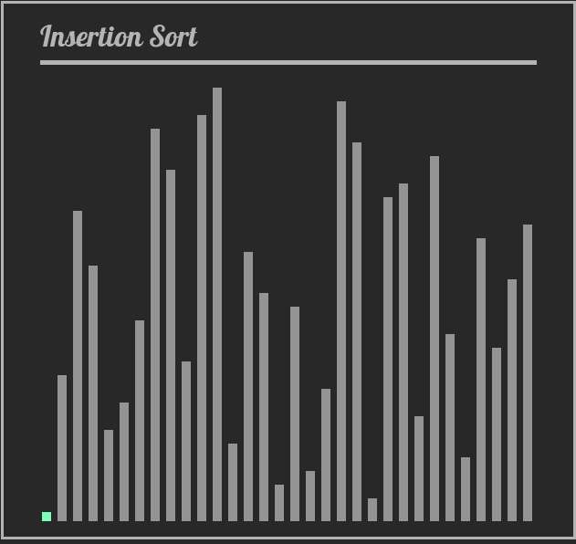
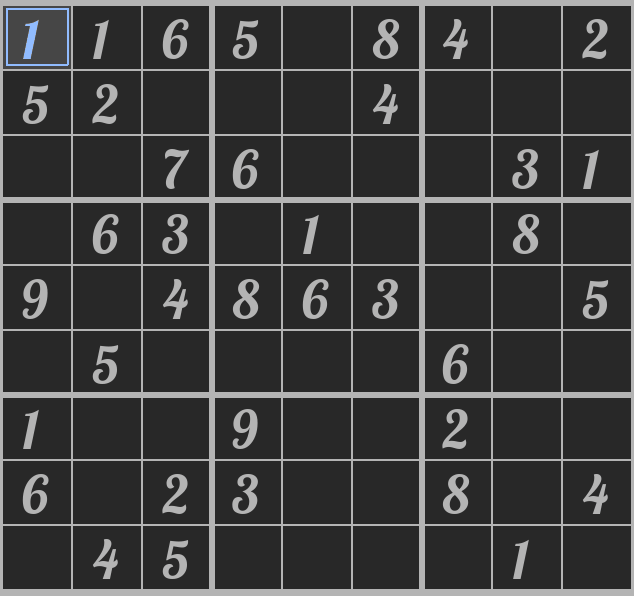
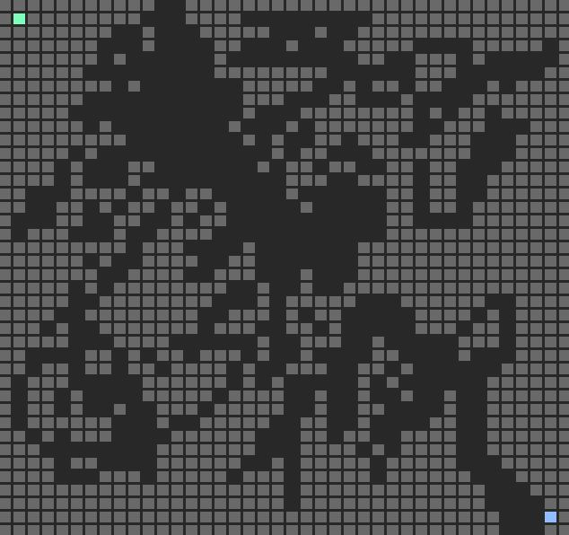

# Algrow

A growing project that contains simulations/visualization of many different types of algorithms for fun/education purposes. Utilizes a classic black and white blackboard style GUI with custom fonts.

### Technology and Tools

   


## Demo

  


## How To Use 

From your command line, clone and run Algrow:

```bash
# Clone this repository
$ git clone https://github.com/saad-afridi/Algrow

# Go into the repository
$ cd Algrow

# Run program
$ python3 main.py
```


## Changelog

As of January 21, 2021

* contains Bubble sort, Insertion sort, Selection sort, Sudoku backtracking and A* pathfinding visualisers
